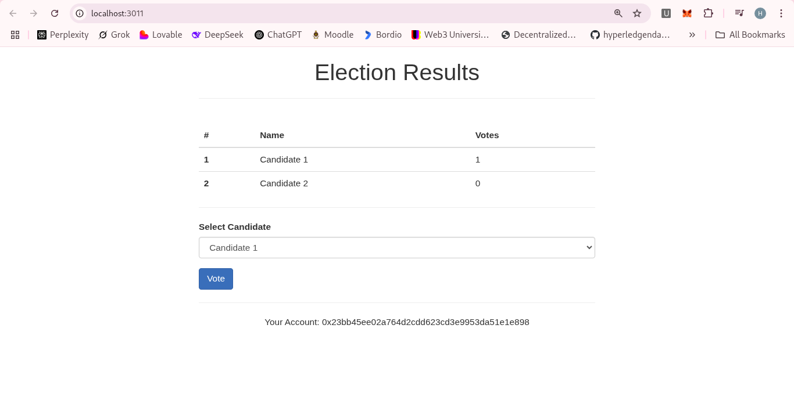
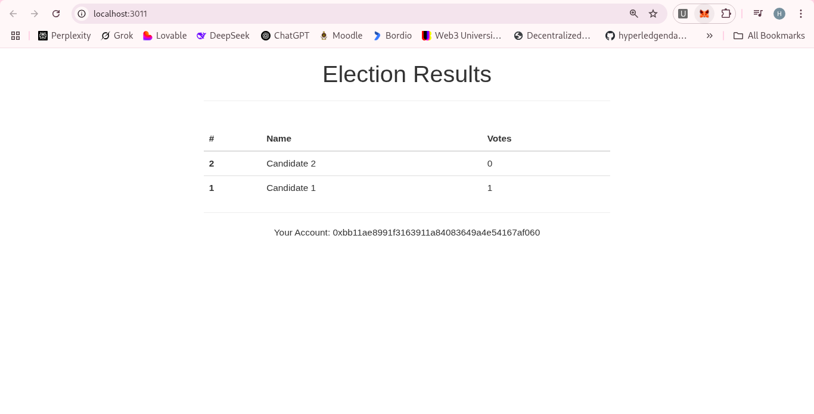
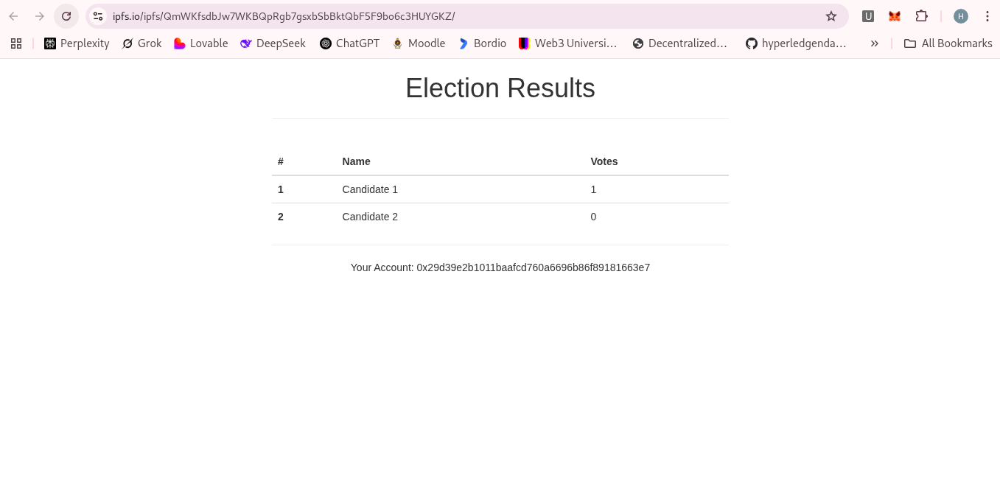

# Blockchain Voting Application

A decentralized voting application built on Ethereum blockchain using Solidity, Truffle, and Web3.js.

## Overview

This application demonstrates a simple voting system where:
- Candidates can be registered on the blockchain
- Voters can cast their vote for a candidate
- Each voter can only vote once
- All votes are recorded on the blockchain, ensuring transparency and immutability

## Features

- Secure voting mechanism
- Prevention of double voting
- Real-time vote counting
- Transparent and immutable vote records
- User-friendly interface

## Prerequisites

- [Node.js](https://nodejs.org/) (v12.0.0 or higher)
- [Truffle](https://www.trufflesuite.com/truffle) (v5.0.0 or higher)
- [Ganache](https://www.trufflesuite.com/ganache) - Personal Ethereum blockchain
- [MetaMask](https://metamask.io/) - Ethereum wallet browser extension

## Installation

1. Clone the repository:
   ```bash
   git clone https://github.com/yourusername/Voting-App.git
   cd Voting-App
   ```

2. Install dependencies:
   ```bash
   npm install
   ```

3. Start Ganache:
   - Open Ganache application
   - Create a new workspace (or use an existing one)
   - Make sure it's running on `HTTP://127.0.0.1:7545`

4. Configure MetaMask:
   - Connect MetaMask to your Ganache blockchain (usually `http://localhost:7545`)
   - Import accounts from Ganache to MetaMask using private keys

## Truffle Commands

### Compile Contracts
Compile the smart contracts:
```bash
truffle compile
```

### Migrate Contracts
Deploy the contracts to the blockchain:
```bash
truffle migrate
```

### Reset and Redeploy
If you need to reset the blockchain and redeploy:
```bash
truffle migrate --reset
```

### Run Tests
Run the test suite to verify contract functionality:
```bash
truffle test
```

### Truffle Console
Open the Truffle console for interacting with contracts directly:
```bash
truffle console
```

### Truffle Development Console
Start Truffle's built-in blockchain and console:
```bash
truffle develop
```

### Deploy to Specific Network
Deploy to a specific network defined in truffle-config.js:
```bash
truffle migrate --network development
```

### Run Specific Test
Run a specific test file:
```bash
truffle test ./test/election.js
```

## Running the Application Locally

1. Deploy the contracts to your local Ganache blockchain:
   ```bash
   truffle migrate --reset
   ```

2. Start the development server:
   ```bash
   npm run dev
   ```

3. Open your browser and navigate to:
   ```
   http://localhost:3000
   ```

4. Connect your MetaMask to the application
5. Cast your vote!

## Deploying to a Public Testnet

1. Install the HDWallet Provider:
   ```bash
   npm install @truffle/hdwallet-provider
   ```

2. Edit the `truffle-config.js` file to add your mnemonic and Infura project ID:
   ```javascript
   const mnemonic = 'YOUR_MNEMONIC'; // Your MetaMask seed phrase
   const infuraProjectId = 'YOUR_INFURA_PROJECT_ID'; // Your Infura project ID
   ```

3. Deploy to the Sepolia testnet:
   ```bash
   truffle migrate --network sepolia
   ```
   - if you need to move with Ganache
   ```bash
   truffle migrate --reset
   ```

4. Note the contract address for future reference.
- *While Ganache is great for local development, deploying to a testnet ensures your application works in a more realistic blockchain environment.*
## Deploying to IPFS

1. Make sure you have IPFS installed and running:
   ```bash
   # Install IPFS if you haven't already
   # For Ubuntu/Debian:
   wget https://dist.ipfs.io/go-ipfs/v0.18.1/go-ipfs_v0.18.1_linux-amd64.tar.gz
   tar -xvzf go-ipfs_v0.18.1_linux-amd64.tar.gz
   cd go-ipfs
   sudo bash install.sh
   ipfs init

   # Start the IPFS daemon in another terminal
   ipfs daemon
   ```

2. Build and deploy the distribution files:
   ```bash
   ./build-ipfs.sh
   ```
   - If not
```bash
ipfs add -r dist
ipfs name publish <hash>
```

3. The script will:
   - Create a dist directory with all necessary files
   - Add the directory to IPFS and get a hash
   - Publish the hash to IPNS for a more permanent link
   - Output URLs where your application is available

4. Access your dApp at:
   - `https://ipfs.io/ipfs/<your-hash>`
   - `https://ipfs.io/ipns/<your-ipns-name>` (more permanent)

5. Users will need to:
   - Have MetaMask installed
   - Connect to the Sepolia testnet
   - Have some Sepolia ETH (available from faucets)

## Smart Contract Structure

### Election.sol
The main contract that handles the voting logic:
- Candidate registration
- Vote casting
- Vote counting
- Prevention of double voting

## Project Structure

```
Voting-App/
├── build/                  # Compiled contracts
│   └── contracts/
├── contracts/              # Smart contracts
│   ├── Election.sol        # Main voting contract
│   └── Migrations.sol      # Truffle migrations contract
├── migrations/             # Deployment scripts
│   ├── 1_initial_migration.js
│   └── 2_election_migration.js
├── node_modules/           # Dependencies
├── src/                    # Frontend application
│   ├── css/                # Stylesheets
│   ├── fonts/              # Font files
│   ├── index.html          # Main HTML file
│   └── js/                 # JavaScript files
│       ├── app.js          # Main application logic
│       ├── bootstrap.min.js
│       ├── truffle-contract.js
│       └── web3.min.js
├── test/                   # Test files
│   └── election.js         # Tests for Election contract
├── bs-config.json          # Lite server configuration
├── package.json            # Project dependencies
├── README.md               # Project documentation
└── truffle-config.js       # Truffle configuration
```

## Testing

The application includes tests to verify:
- Initial state of the contract
- Candidate registration
- Vote casting
- Prevention of double voting
- Invalid candidate voting

Run the tests with:
```bash
truffle test
```

## Troubleshooting

### MetaMask Connection Issues
- Make sure Ganache is running
- Verify MetaMask is connected to the correct network
- Reset your MetaMask account if transactions are pending

### Contract Deployment Issues
- Ensure Ganache is running before deploying contracts
- Check truffle-config.js for correct network settings
- Use `truffle migrate --reset` to redeploy contracts

### Rendering Issues
- Clear browser cache
- Ensure all JavaScript files are properly loaded
- Check browser console for errors

## License

This project is licensed under the MIT License - see the LICENSE file for details.

## Acknowledgments

- Truffle Suite for the development framework
- Ethereum community for blockchain technology
- Bootstrap for frontend styling





